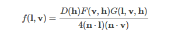
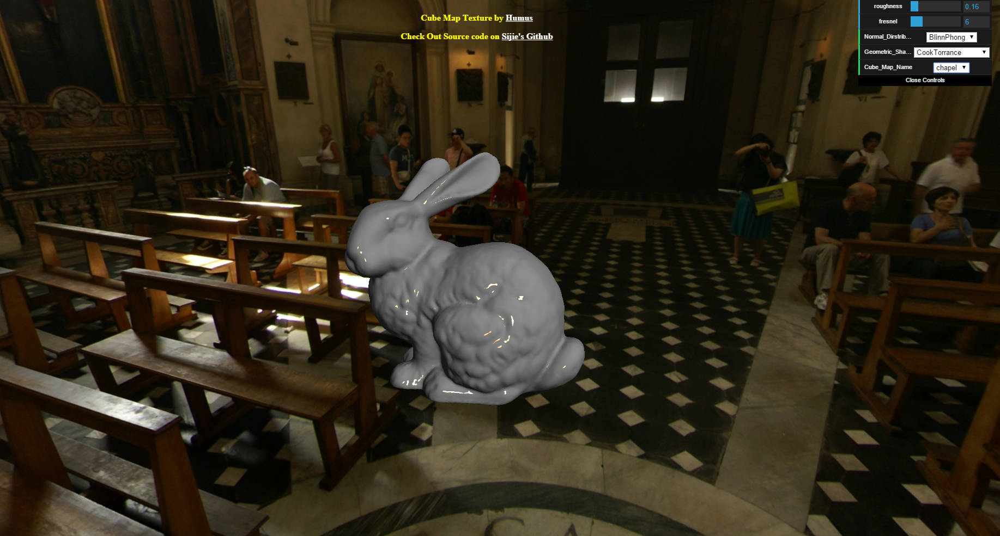
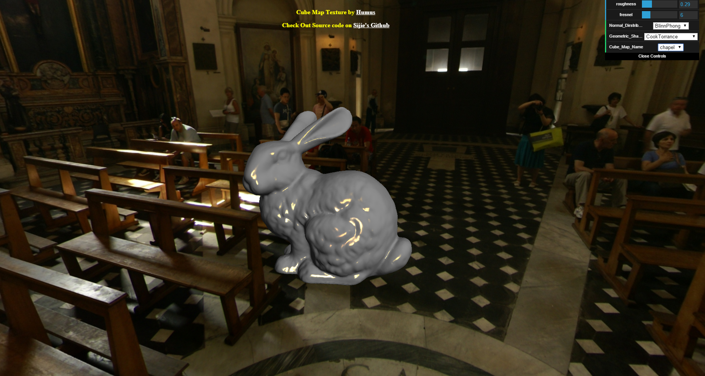
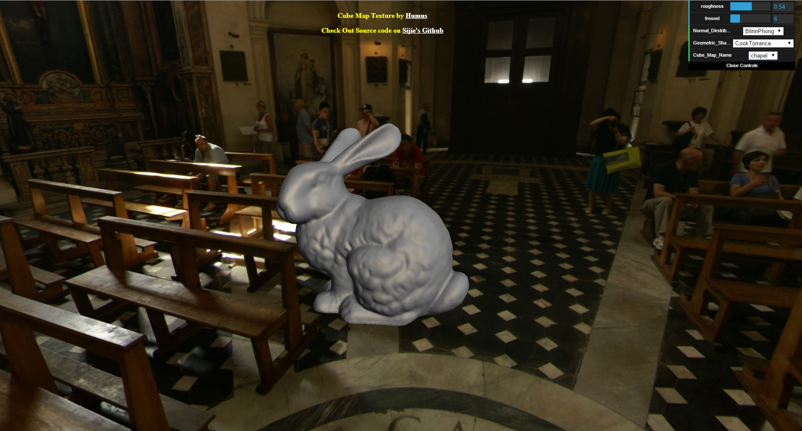
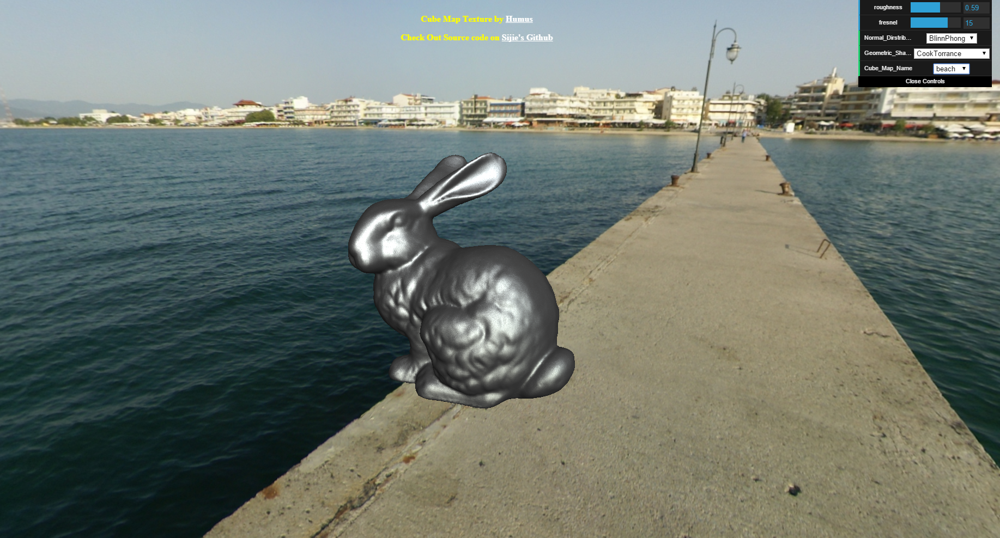

WebGL Physical Based Shader
========
A physical based shader using three.js

[Live Demo](http://sijietian.com/WebGL/pbr/)

User can teak roughness and frenel value of the model.

Also you can switch different methods in the **Cook-Torrance microfacet specular BRDF**. 

 

You also can play around the environment.

Screen Shots:

 

**Mainly based on these resources**

* http://graphicrants.blogspot.ca/2013/08/specular-brdf-reference.html

* http://simonstechblog.blogspot.com/2011/12/microfacet-brdf.html

* http://graphicrants.blogspot.ca/2013/08/specular-brdf-reference.html

**Other resources:**

* http://renderwonk.com/publications/s2010-shading-course/hoffman/s2010_physically_based_shading_hoffman_a_notes.pdf

* http://blog.selfshadow.com/publications/s2013-shading-course/

* http://www.gamedev.net/topic/638197-cook-torrance-brdf-general/

* http://www.gamingfreedom.org/content/21/14-cook-torrance.pdf

* http://lousodrome.net/blog/light/tag/physically-based-rendering/page/2/

* http://www.humus.name/index.php?page=Textures

* http://antongerdelan.net/opengl/cubemaps.html

* http://holger.dammertz.org/stuff/notes_HammersleyOnHemisphere.html

* http://blog.selfshadow.com/publications/s2013-shading-course/karis/s2013_pbs_epic_notes_v2.pdf

* http://www.rorydriscoll.com/2009/01/07/better-sampling/

* http://www.iquilezles.org/www/index.htm
